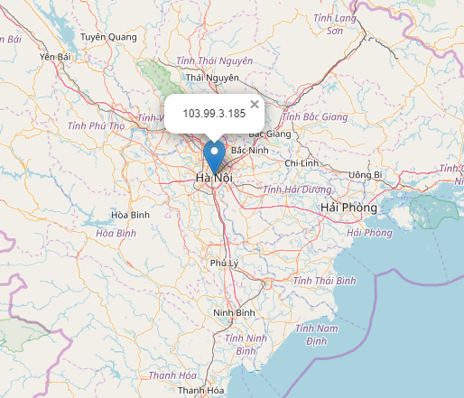

# Check Reputation

 [](https://twitter.com/pulsecode)

Check IP or Domain reputation against several open-source Blacklists.

Option to create a Geolocation map file using coordinates derived from [freegeoip.live](https://freegeoip.live).

***Note:***
Use of VirusTotal option requires an API key.  The service is free, however you must register for an account to aquire an API key.

```console
   ________              __      ____
  / ____/ /_  ___  _____/ /__   / __ \___  ____
 / /   / __ \/ _ \/ ___/ //_/  / /_/ / _ \/ __ \
/ /___/ / / /  __/ /__/ ,<    / _, _/  __/ /_/ /
\____/_/ /_/\___/\___/_/|_|  /_/ |_|\___/ .___/
                                       /_/

Check IP and Domain Reputation
usage: check_rep.py [-h] [-q query] [--log] [--vt] [--fg | --mx FILE [FILE ...]]

Check IP or Domain Reputation

required arguments:
  -q query              query ip address or domain

optional arguments:
  -h, --help            show this help message and exit
  --log                 log results to file
  --vt                  check virustotal
  --fg                  use freegeoip for geolocation
  --mx FILE [FILE ...]  geolocate multiple ip addresses or domains

    Options
    --------------------
    freegeoip [freegeoip.live]  - free/opensource geolocation service
    virustotal [virustotal.com] - online multi-antivirus scan engine

    * NOTE:
    Use of the VirusTotal option requires an API key.
    The service is "free" to use, however you must register
    for an account to receive an API key.
```

## Installation

```text
git clone https://github.com/dfirsec/check_rep.git
cd check_rep
pip install -r requirements.txt
```

### Example Run

[](https://asciinema.org/a/r6VDD8QaHsaj3Fzo1wjU96BmQ)

### Geolocation Map File


